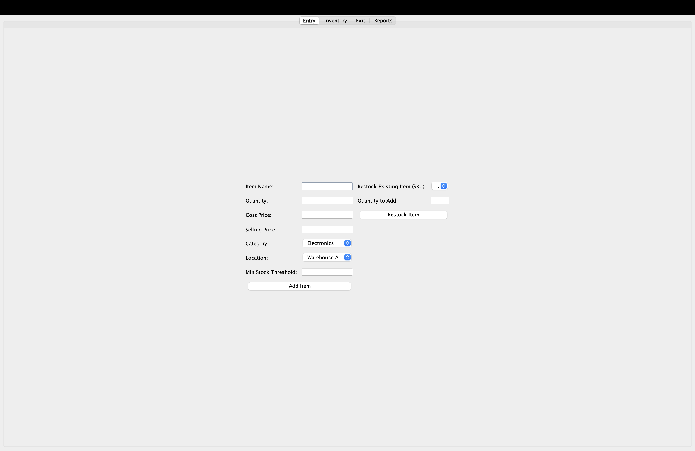

# 🧮 InventoryManagementApp

A simple, all-in-one **Inventory Management System** built using **Java Swing** — no database, no dependencies, just a pure desktop app.

---

## 🧾 About
InventoryManagementApp is a simple Java-based GUI application built using Swing.  
It allows users to efficiently manage inventory — add items, restock, record sales, and track product details.  
This project demonstrates basic CRUD operations, GUI handling, and file-based data persistence.

## 🌟 Features
- Add, delete, and restock items  
- Real-time stock tracking  
- Search and filter inventory  
- Low-stock highlighting  
- Sales recording and reporting  
- Export inventory data to CSV
- Add, update, and remove inventory items
- Real-time stock tracking
- Simple and clean Swing-based interface
- Automatic data saving and loading

---

## ⚙️ Tech Stack
- **Language:** Java  
- **GUI Framework:** Swing  
- **File Handling:** CSV export using `java.io.PrintWriter`

---

## 🖥️ How to Run

### Step 1: Save the file
Download or copy this file into your project folder as:

### step 2 : compile the java file
javac InventoryManagementApp.java

### step 3 : run the file
java InventoryManagementApp

## 📸 Screenshots

### Dashboard View

### Add Product Page

